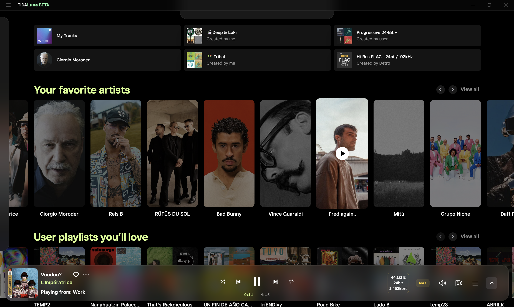
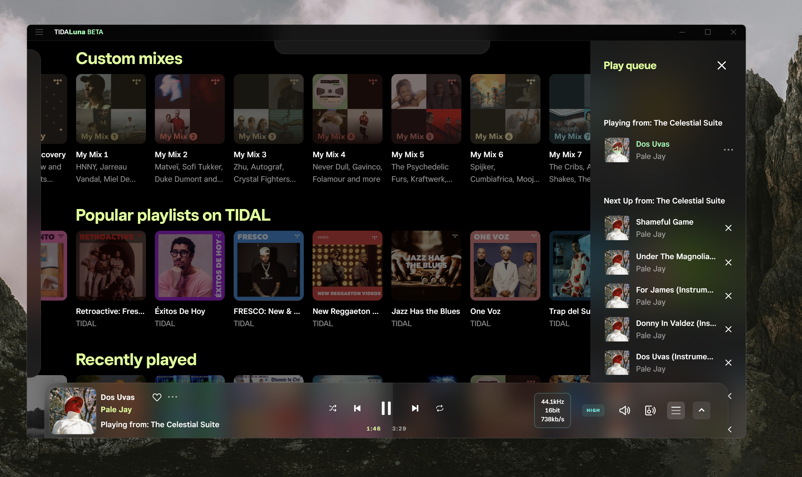
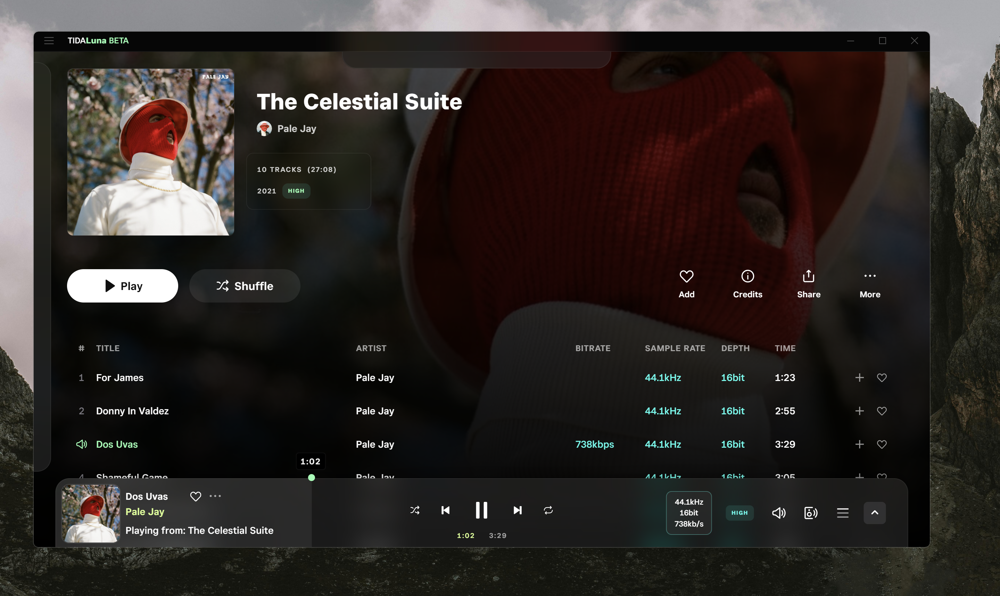
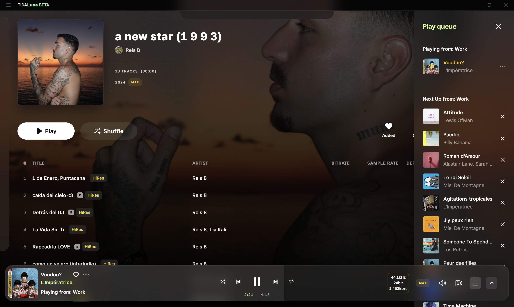
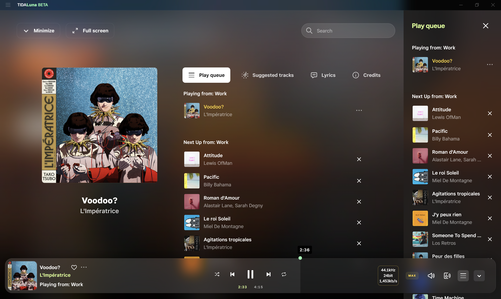

# Lunallena 🌕

"Full moon" Experience for Tidal (web and desktop app).
A minimalist, immersive, and elegant interface.

- **Auto-hide:** Sidebar & header are hidden by default (they pop up on hover).
- **Fully Customizable:** CSS variables allow you to tune colors and effects to your liking.
- **Glassmorphism:** A clean, modern "frosted glass" aesthetic.

---

## 🛠️ Desktop Installation (With Tidaluna)

The best way to experience **Lunallena** on the desktop client.

1.  **Install Luna Client Mod:** Run the installer. If you don't have it:
    * [**Download Luna Installer**](https://github.com/Inrixia/TidaLuna)
2.  **Open Luna Settings:** In Tidal, click the **three-dot menu** next to your profile icon and select **Luna settings**.
3.  **Apply Theme:** * Go to the **Themes** tab in Luna Settings.
    * Click on **Add Theme**.
    * Paste the following **Raw URL**:
      `https://raw.githubusercontent.com/Acercandr0/Lunallena/main/Lunallena.css`
4.  **Auto-Updates:** This method keeps your theme updated! Tidaluna will automatically fetch changes from the repository.

---

## Browser Installation Guide: Stylus

The fastest way to use **Lunallena** in your web browser (Chrome, Firefox, Edge, Opera).

1. **Install Stylus:** If you don't have it yet, download the extension:
    * [**Stylus for Chrome/Edge**](https://chromewebstore.google.com/detail/stylus/clngdbkpkpeebahjckkjfobafhncgmne)
    * [**Stylus for Firefox**](https://addons.mozilla.org/en-US/firefox/addon/styl-us/)
2. **Install Lunallena:** Visit the official theme page:
    * [**Lunallena on UserStyles.world**](https://userstyles.world/style/26078/lunallena)
3. **One-Click Setup:** Click the **"Install"** button. Stylus will open a confirm page.
4. **Confirm:** Click **"Install Style"** on the left. You're done!
5. **Auto-Updates:** Updates are **fully automatic**. Stylus will check for new versions and keep your theme up to date.

---

## 🧉 Made with cariño by [@Acercandr0](https://github.com/Acercandr0)
Enjoy it. Fork it. Remix it. Make it yours.